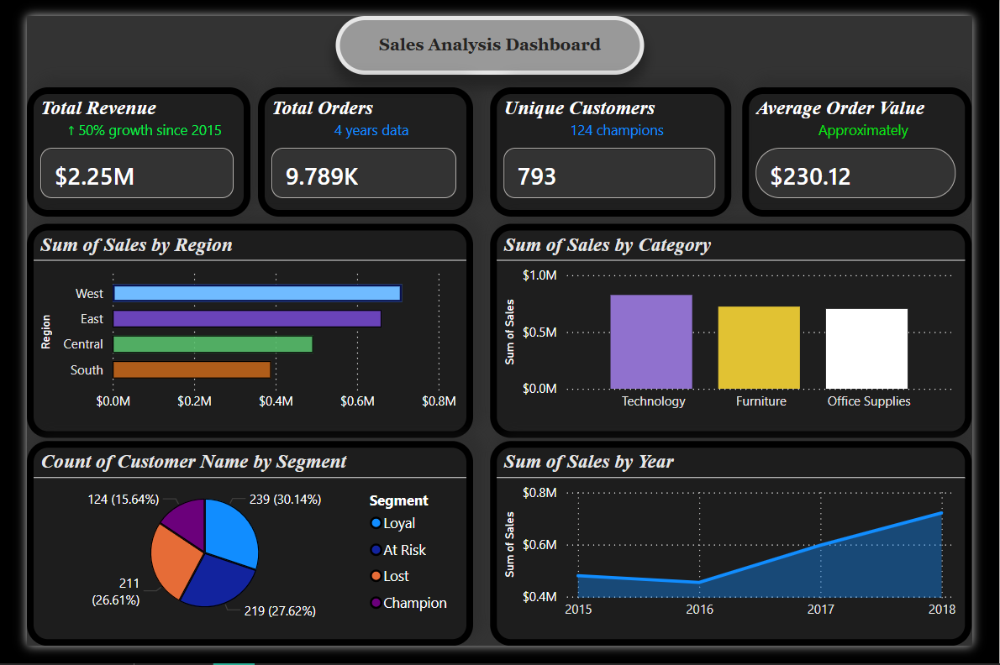

# End-to-End Sales Analytics, Customer Segmentation & Forecasting | Python, SQL, Power BI & Prophet

## Project Overview

End-to-end sales data analysis on **9,789 orders** using Python, SQL, Power BI, and Streamlit. The project focuses on uncovering business insights through Exploratory Data Analysis (EDA), customer segmentation using RFM Analysis, and future sales prediction using Machine Learning.

An interactive Power BI dashboard and Streamlit web application were developed to visualize business performance, customer behavior, and sales forecasting results.

## Key Findings

* West region contributes the highest revenue (**$710K+**)
* Technology category leads with **$825K+** in sales
* Revenue grew by approximately **50%** from 2015 to 2018
* Identified **124 Champion Customers** through RFM Analysis
* Segmented **793 customers** into actionable customer groups
* Forecasted future sales trends using Prophet Time Series Forecasting

## Customer Segmentation (RFM Analysis)

Performed customer segmentation based on:

* **Recency** – How recently a customer made a purchase
* **Frequency** – How often a customer purchases
* **Monetary Value** – Total spending by the customer

### Customer Segments

* Champions
* Loyal Customers
* Potential Loyalists
* At-Risk Customers
* Lost Customers

These segments help businesses improve customer retention, engagement, and targeted marketing strategies.

## Sales Forecasting

Implemented a time-series forecasting model using **Meta Prophet** to predict future sales based on historical monthly sales data.

### Forecasting Methodology

* Monthly sales aggregation
* Train-Test Split (Last 9 Months used as Test Data)
* Yearly Seasonality Enabled
* Multiplicative Seasonality Mode
* Automatic Trend Detection

### Model Performance

 Metric        Score  
 R² Score      0.547 
 MAE       12,442.91 
 RMSE      16,952.93 

### Forecasting Outcomes

* Captured long-term sales trends and seasonal patterns
* Generated future sales projections for business planning
* Demonstrated integration of predictive analytics with business intelligence workflows

## Interactive Dashboard & Web Application

### Power BI Dashboard

Features:

* Sales Performance Overview
* Regional Analysis
* Category-wise Revenue Insights
* Customer Segmentation Metrics
* Year-over-Year Growth Tracking
* Interactive Filters and Drill-down Analysis

### Streamlit Application
Local URL: http://localhost:8506
  Network URL: http://10.218.159.127:8506
Developed an interactive Streamlit application to make analytics and forecasting results accessible through a user-friendly web interface.

Features:

* KPI Monitoring
* Dynamic Data Exploration
* Customer Segmentation Insights
* Sales Trend Analysis
* Forecast Visualization
* Interactive Filtering

## Tech Stack

### Data Analysis

* Python
* Pandas
* NumPy
* Matplotlib
* Seaborn

### SQL Querying

* Pandasql

### Machine Learning & Forecasting

* Prophet
* Scikit-learn

### Business Intelligence

* Power BI

### Web Application

* Streamlit

### Development Environment

* Jupyter Notebook

## Project Structure

sales_analysis.ipynb        # EDA + RFM Analysis + Sales Forecasting
app.py                      # Streamlit Application
op1 dashboard.pbix          # Power BI Dashboard
superstore_clean.csv        # Cleaned Dataset
rfm_data.csv                # RFM Segmentation Data
dashboard.png              # Dashboard Preview
forecast_visualization.png # Forecast Output
requirements.txt           # Dependencies
README.md

## Dashboard Preview

## Results & Business Impact

* Identified top-performing regions and product categories
* Segmented customers for targeted marketing and retention strategies
* Recognized high-value customers driving revenue growth
* Forecasted future sales trends using Machine Learning
* Built interactive dashboards for data-driven decision-making
* Delivered business insights through both Power BI and Streamlit applications

